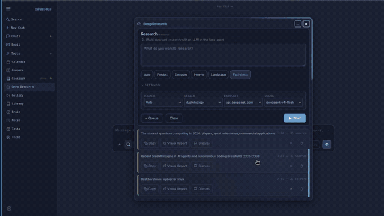
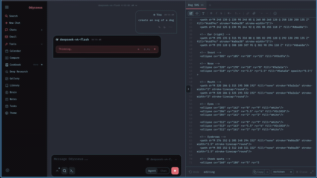

# Cerberus

> Security-hardened, self-hosted AI workspace. Cerberus guards the gate — every agent action runs inside an isolated sandbox so it can never touch the host directly.


| | |
|---|---|
|||
|||
|||

```
───────────────────────────────────────────────
  Cerberus vers. 1.0 — Guardian of the Gate
───────────────────────────────────────────────
```

Built on top of [odysseus](https://github.com/pewdiepie-archdaemon/odysseus) (AGPL-3.0), with three pillars:

- **Backbone** — odysseus: chat, deep research, docs, email, calendar, agent loop, web UI
- **Sandbox** — [OpenSandbox](https://github.com/opensandbox-group/OpenSandbox) (Apache-2.0): every agent shell/code action runs in an isolated container, never on the host
- **Connectivity** — [hermes-agent](https://github.com/NousResearch/hermes-agent) (MIT): Telegram, Slack, Discord, and more — reach Cerberus from any messaging platform

## Features

- **Chat** — chat with any local model or API; adding them is simple.
  `vLLM · llama.cpp · Ollama · OpenRouter · OpenAI · GitHub Copilot`
- **Agent** — hand it tools and let it run the whole task itself. Every shell/code command runs inside OpenSandbox — isolated from the host.
  `MCP · web · files · sandboxed shell · sandboxed Python · skills · memory`
- **Cookbook** — scans hardware, recommends models, click to download and serve.
  `VRAM-aware · GGUF / FP8 / AWQ · fit scoring · vLLM / llama.cpp serving`
- **Deep Research** — multi-step runs that gather, read, and synthesize sources into a visual report.
- **Compare** — compare models side by side, blind test, no bias.
- **Documents** — multi-tab editor with AI assists: markdown, HTML, CSV, syntax highlighting.
- **Memory / Skills** — persistent memory and skills; the agent evolves over time.
  `ChromaDB · fastembed (ONNX) · vector + keyword retrieval · import/export`
- **Email** — IMAP/SMTP inbox with AI triage: urgency reminders, auto-tag, auto-summary, draft replies.
- **Notes & Tasks** — quick notes, todos, scheduled tasks the agent can act on.
- **Calendar** — local-first with CalDAV sync to Radicale / Nextcloud / Apple / Fastmail.
- **Connectivity** — Telegram (+ Discord/Slack extensible) via the hermes gateway.
- **Mobile-ready** — responsive, installable as PWA, touch gestures.

## Security model

Cerberus is hardened beyond the upstream odysseus defaults:

| Control | Status |
|---------|--------|
| Auth always on | `AUTH_ENABLED=true` hardcoded |
| Localhost-only bind | `APP_BIND=127.0.0.1` |
| LOCALHOST_BYPASS removed | Permanently disabled |
| Internal token unpredictable | Generated at process start, never from env |
| Tmux shell injection fixed | `cmd` wrapped in `shlex.quote()` |
| Agent execution sandboxed | OpenSandbox isolates every shell/code call |

See `SECURITY_AUDIT.md` for the full Phase 0 findings and `SECURITY.md` for the threat model.

## Quick start (localhost, no real keys)

```bash
cd cerberus
cp .env.example .env          # edit with your LLM host if needed
python setup.py               # creates data/, DB, admin account
python -m uvicorn app:app --host 127.0.0.1 --port 7000
# open http://localhost:7000
```

> **Binding note:** use `--host 127.0.0.1` (loopback). Use `0.0.0.0` only when you intentionally want
> to expose the server to the local network — never do this without a reverse proxy and TLS in front.

Docker Compose (recommended):

```bash
docker compose up -d
# opens http://localhost:7000
```

## Attribution

Cerberus is a hardened fork of odysseus. See:

- `ACKNOWLEDGMENTS.md` — upstream credits
- `THIRD_PARTY_LICENSES.md` — full license texts for all vendored dependencies
- `PROVENANCE.md` — pinned upstream commit SHAs

odysseus copyright © pewdiepie-archdaemon contributors, AGPL-3.0 License.
OpenSandbox copyright © 2025 Alibaba Group Holding Ltd., Apache-2.0 License.
hermes-agent copyright © NousResearch contributors, MIT License.
